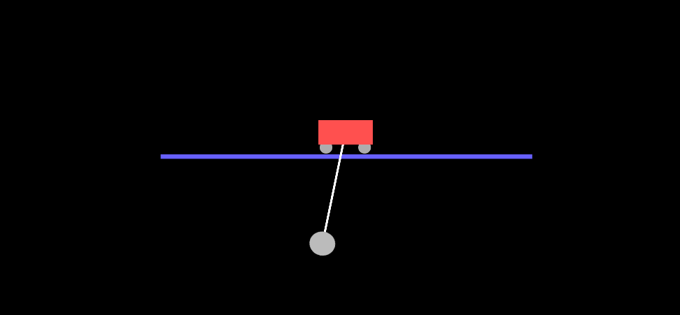
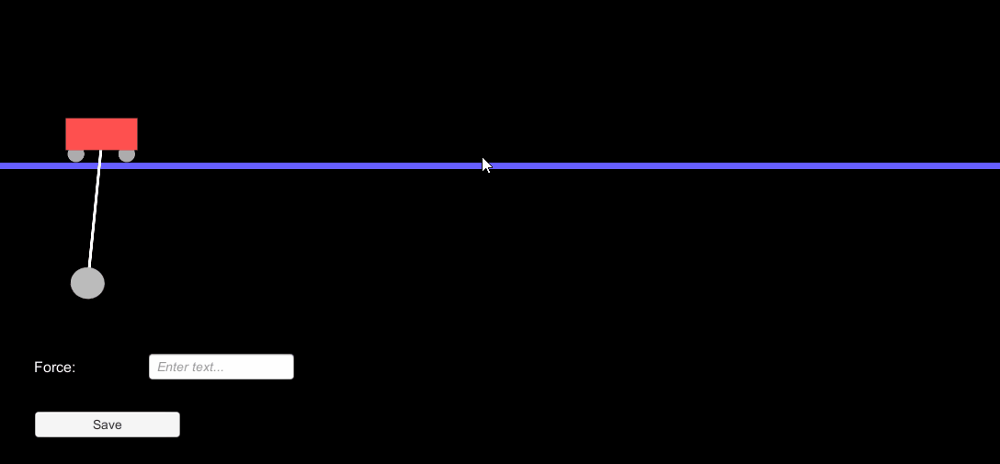

# Pendulum
This project implements a simple pendulum and cart in 2D using Unity. 
This is what the animation looks like for the pendulum alone with the hardcoded values:

And the animation including the GUI and moving cart:

